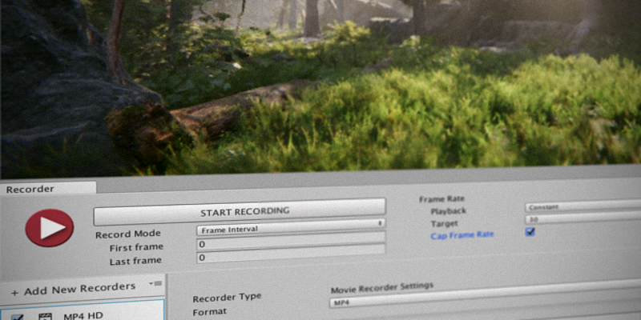
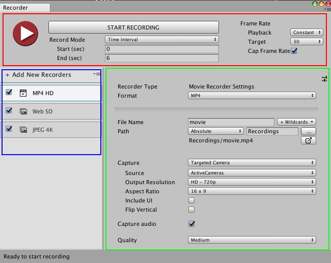

# Unity Recorder V1.0 User Manual

Use the Unity Recorder to capture and save in-game data during [Play Mode](https://docs.unity3d.com/Manual/GameView.html). For example, use the Unity Recorder to capture and save gameplay as an MP4 file.

A recorder specifies details for creating a recording, including a data source, resolution, and output format. The Unity Recorder package includes the following recorders:

* __Animation Recorder__: generates an animation clip in ANIM format.

* __Movie Recorder__: generates a video in MP4 or WebM format.

* __Image Recorder__: generates a sequence of image files in JPEG, PNG, or OpenEXR format.

* __GIF Recorder__: generates an animated GIF file.

The Unity Recorder also supports [Timeline](https://docs.unity3d.com/Manual/TimelineSection.html). Use Recorder tracks and clips to trigger recording sessions from Timeline instances.

## Limitations

The Unity Recorder has the following limitations:

* The Recorder window and Recorder properties are not available in standalone Unity Players.

* To use Unity Recorder with Scriptable Render Pipeline (SRP) or High Definition Render Pipeline (HDRP), use only the __Game View__, __360 View__, or __Render Texture__ choices in the __Capture__ drop-down menu.

* The __Animation Recorder__ only records a [GameObject](https://docs.unity3d.com/Manual/class-GameObject.html) in the current Scene. It does not record a GameObject in other scenes.

* The __Movie Recorder__ does not support variable frame rates.

* The Unity Recorder does not capture frames at a consistent rate from systems that use a real-time clock, like the [Video Player](https://docs.unity3d.com/Manual/VideoPlayer.html). Data captured from these systems might appear speeded up or slowed down.

# Upgrading Unity Recorder

Besides new features, Unity Recorder 1.0 has a few notable changes:

* Use the __Window > General > Recorder__ menu to access Unity Recorder features. Features for older versions of Unity Recorder were accessible from the __Window > Recorder__ menu.

* Unity Recorder includes new, updated recorders. These recorders take advantage of Unity Editor features and are more stable than previous versions. However, if you must use the legacy recorders, toggle __Window > General > Recorder > Options > Show Legacy Recorders__.

To upgrade to Unity Recorder 1.0 from an earlier version:

1. In Unity Editor, open your Unity Project.

2. Save the current Scene.

3. In the [Project](https://docs.unity3d.com/Manual/ProjectView.html) window, expand the *Unity Technologies* folder and select the *Recorder* folder.

4. In the main menu, choose __Edit > Delete__.

5. Quit Unity then re-open your project.

6. Use the [Unity Asset Store](https://docs.unity3d.com/Manual/AssetStore.html) to search for and install Unity Recorder 1.0.

# Setting up Recorders

Use the recorder list in the __Recorder__ window to add, rename, edit, duplicate, and delete recorders. You can also save and delete your recorder list as an asset to reuse in your project and in other projects.

**Tip:** You can save a recorder as a [Preset](https://docs.unity3d.com/Manual/Presets.html). You can also specify a preset for recorder settings as a default when creating new recorders.

Re-opening the __Recorder__ window restores the values of the last recording session.

To add a recorder:

1. Open the Recorder from the Unity menu (__Window > General > Recorder__).

2. In the recorder list, click __+ Add New Recorders__ to choose from a drop-down menu.

3. Adjust the settings for the new recorder.

4. Optionally rename the new recorder by single-clicking its name.

To delete or duplicate a recorder:

1. Open the Recorder from the Unity menu (__Windows > General > Recorder__).

2. In the recorder list, right-click the recorder and choose __Delete__ or __Duplicate__.

__Tip:__ You can also delete and duplicate recorders with the Delete and Ctrl+D/Cmd+D keys, respectively.

To save, load, or clear settings for all recorders:

1. Open the Recorder window from the Unity menu (__Windows > General > Recorder__).

2. In the recorder list, click the drop-down menu.

3. Do one of the following:

    * To save your recorder list as an asset, choose __Save Recorder List__.

    * To load a recorder list, choose __Load Recorder List__, then the list to load.

    * To delete all recorders in your list, choose __Clear Recorder List__.

# Recording in Play Mode

When recording in Play Mode, use the __Record Mode__ property to specify when to start and stop the recording. You can manually start and stop recording, specify a single frame, a range of frames, or a range of time. You can set up more than one recorder to record the same Scene.

**Note:** During recording, you cannot modify the properties in the Recorder window.

To record a scene in Play Mode:

1. Set up your scene to prepare it for recording.

2. Open the Recorder from the Unity menu (__Window > General > Recorder__).

3. In the recorder list, select then set up the recorder to use.

4. Set the __Record Mode__ and __Frame Rate__ properties.

5. Repeat steps 3-4 to use other recorders for the same Scene.

6. Click __Start Recording__ or press F10. Unity Recorder activates Play Mode if it is not already active. The progress bar displays the number of frames or images recorded.

7. When you are ready to stop recording, click __Stop Recording__ or press F10. You only need to stop recording when using the Manual record mode.  Your game continues in Play Mode.

**Tip:** Closing the Recorder window, or exiting Play Mode and returning to Edit Mode, also stops the recording.

# Recording from a Timeline track

You can start and stop recordings from the [Timeline](https://docs.unity3d.com/Manual/TimelineSection.html). A __Recorder Track__ in Timeline contains one or more __Recorder Clips__. Each clip specifies a recording to start and stop while Timeline plays the __Recorder Track__.

A __Recorder Clip__ has the same properties as a recorder in the Recorder window except for the following differences:

* Recording mode can only be set to Constant. Timeline can only play using a constant frame rate.

* The frame rate of the recording inherits from the Timeline’s __Frame Rate__ setting.

* The __Clip Timing__ section replaces the __Bounds/Limits__ section. Instead, use the __Start__, __End__, and __Duration__ properties to set when recording occurs.

* Use the __Recorder Category__ property to select which recorder the Timeline clip uses.

* The __Recorder Clip__ properties are stored in the Timeline Track and do not affect the properties in the Recorder window.

To set up a recording session in a Timeline instance:

1. Select the GameObject in your Scene that is associated with the Timeline Asset.

2. In the Timeline window, click __Add__ and select __Recorder Track__.

3. Right-click the __Recorder Track__ and select __Add Recorder Clip__.

4. Select the __Recorder Clip__ to view and edit its recording properties in the __Inspector__ window.

# Debugging Recorders

You can view the GameObject that Unity Recorder creates in your Scene. This GameObject is named __Unity-RecorderSessions__. It contains the components and child GameObjects that the Unity Recorder creates to maintain bindings between the Recorder and the GameObjects in your Scene. Also, while recording, the __Unity-RecorderSessions__ GameObject contains components that store the progress of current recording session. It is by default hidden from the [Hierarchy](https://docs.unity3d.com/Manual/Hierarchy.html) window.

To toggle the visibility of the __Unity-RecorderSessions__ GameObject, choose __Window > General > Recorder > Options > Show Recorder GameObject__.

# Recorder Window

Manage recorders and control recording in the Recorder window. The Recorder window has these sections:

* Recording controls: Start and stop recordings, and specify their duration and frame rate.

* Recorder list: the recorders you have added or loaded.

* Recorder properties: Specify the recording properties, such as the output format and encoding, file name and location.

## Recording controls

Use the recording controls to start and stop a recording. Specify when to start and stop a recording with the __Record Mode__ properties. Use the __Frame Rate__ properties to specify how to constrain the frame rate during recording. The frame rate affects the size and number of the captured output files.

|Property:|Function:|
|:---|:---|
| __Start Recording__   __Stop Recording__ |Starts and stops recording. Clicking __Start Recording__ also activates Play Mode if it is not already active.|
| __Record Mode__ |Specifies the frames or time duration to record.|
|&nbsp;&nbsp;&nbsp;&nbsp; _Manual_ |Start and stop recording when you manually click __Start Recording__ and __Stop Recording__, respectively.|
|&nbsp;&nbsp;&nbsp;&nbsp; _Single Frame_ |Record a single frame. Use the __Frame Number__ property to specify this frame.|
|&nbsp;&nbsp;&nbsp;&nbsp; _Frame Interval_ |Record a consecutive set of frames during Play Mode. Use the __First Frame__ and __Last Frame__ properties to specify when to start and stop.|
|&nbsp;&nbsp;&nbsp;&nbsp; _Time Interval_ |Record a specific duration during Play Mode. Use the __Start__ and __End__ properties to specify when to start and stop.|
| __Frame Number__ |Specifies the number of the frame to capture when using the __Single Frame__ mode.|
| __First Frame__   __Last Frame__ |Specifies the range of frames to capture when in __Frame Interval__ mode.|
| __Start__   __End__ |Specifies the time, in seconds, to begin and finish recording.|
| __Playback__ |Specifies how to control the frame rate during recording.|
|&nbsp;&nbsp;&nbsp;&nbsp; _Constant_ |Limit the recorder to a specific frame rate. Use the __Target__ property to specify this rate.|
|&nbsp;&nbsp;&nbsp;&nbsp; _Variable_ |Use the frame rate of the game. Specify the upper limit of the rate of the game during recording with the __Max Frame Rate__ property. **Note:** The __Movie Recorder__ does not support a variable frame rate.|
| __Target__ |The frame rate to capture when using the __Constant__ setting in __Playback__. The Unity Recorder captures at this rate regardless of whether the game is played at a higher or lower frame rate. For example, if __Target__ is set to a custom value of 30 fps but the game plays at 60 fps, the recording is captured at 30 fps.|
| __Max Frame Rate__ |Limit the rate of updates in Play Mode. This property is available when __Playback__ is __Variable__. To prevent your game from exceeding this frame rate, the Unity Recorder inserts delays during game play. Use this property to reduce the size of the output.|
| __Cap Frame Rate__ |Check this property when the frame rate of your game is faster than the __Target__ frame rate. This property is available when __Playback__ is __Constant__.|

## Recorder properties

These properties specify the file name and location to store the output from a recorder. These properties are available for all recorders.

Some recorders, like the __Animation Recorder__, can only record inside the Assets folder.

**Tip:** Click  to reveal the output files in Windows Explorer/Mac OS Finder.

|Property:|Function:|
|:---|:---|
| __File Name__ |The name of the output file. Use the text field to specify the pattern to use for recording many files. Choose placeholders from the __+Wildcards__ drop-down menu.|
| __+Wildcards__ |The placeholder text to insert in File Name. The recorder replaces these placeholders when saving the output file. You may combine wildcards.|
| __Path__ |The folder where output files are saved. Use the drop-down menu to choose a pre-defined Unity folder. Choose __Absolute__ to specify a custom directory or click __...__ to navigate to a custom directory.|

## Movie Recorder properties

The __Movie Recorder__ generates a video in MP4 or WebM format. It does not support variable frame rates.

|Property:|Function:|
|:---|:---|
| __Format__ |The encoding format of the output of the recorder. Choose __MP4__ or __WEBM__.|
| __Capture Alpha__ |Check to include the alpha channel in the recording. Uncheck to only record the RGB channels. This property is only available when __Format__ is __WEBM__. This property is not available when __Capture__ is __Game View__.|
| __Capture__ |The input for the recording.|
|&nbsp;&nbsp;&nbsp;&nbsp; _Game View_ |Record the frames that are rendered in the Game View. |
|&nbsp;&nbsp;&nbsp;&nbsp; _Targeted Camera_ |Record the frames captured by a specific camera, even if it is not used in the Game View.|
|&nbsp;&nbsp;&nbsp;&nbsp; _360 View_ |Record a 360-degree video. Use the Source camera as the point of view for the video. The recorder captures 360 degrees on the y-axis of the __Source__ camera.|
|&nbsp;&nbsp;&nbsp;&nbsp; _Render Texture Asset_ |Capture the frames that are rendered in a Render Texture.|
|&nbsp;&nbsp;&nbsp;&nbsp; _Texture Sampling_ |When capturing, supersample the Source camera to generate anti-aliased images in the output. Use this capture method when the __Rendering Resolution__ has the same or higher resolution than the __Output Resolution__. |
| __Render Texture__ |The Render Texture asset to use as the source for frames. Available when __Capture__ is set to __Render Texture Asset__. The output resolution of the recording is fixed to the resolution of the Rendure Texture.|
| __Super Sampling__ |The size of the grid from which to sample. This property is available when __Capture__ is __Texture Sampling__.|
| __Source__ |The camera to use for recording. Choose __Active Cameras__, __Main Camera__, or __Tagged Camera__.  The __Main Camera__ option specifies the camera with the MainCamera tag. Available when __Capture__ is set to __Targeted Camera__, __360 View__, or __Texture Sampling__.|
| __Tag__ |The tag of the camera to record. Available when __Capture__ is set to __Targeted Camera__ and __Source__ is __TaggedCamera__.|
| __360 View Output__ |The width and height, in pixels, of the 360-degree video. This property is available when __Capture__ is __360 View__.  |
| __Cube Map__ |The dimension of the cube map, in pixels, for the 360-degree video. This property is available when __Capture__ is __360 View__.  |
| __Stereo__ |Check to generate both a left and right stereoscopic view for a 360-degree video. This property is available when __Capture__ is __360 View__.  |
| __Stereo Separation__ |The angle to separate the left and right views. This separation is along the y-axis of the __Source__ camera. This property is available when __Capture__ is __360 View__.|
| __Rendering Resolution__ |The dimensions of the input from which to sample.  This property is available when __Capture__ is __Texture Sampling__.|
| __Output Resolution__ |The dimensions of the video recording. This property is available only for applicable __Capture__ choices.|
| __Aspect Ratio__ |The width:height ratio to format the output to.|
| __Flip Vertical__ |Check to flip the images in the output to make it upside-down. Use this property to restore up and down when your system generates video that is flipped vertically.|
| __Capture Audio__ |Check to include audio in the recording.|
| __Quality__ |The quality of the output: __Low__, __Medium__, or __High__. The lower the quality, the smaller the size of the output file.|

## Animation Recorder properties

The __Animation Recorder__ generates an animation clip in ANIM format.

|Property:|Function:|
|:---|:---|
| __Game Object__ |The GameObject to record.|
| __Recorded Target(s)__ |The components of the GameObject to record. Choose more than one item to record more than one component.|
| __Record Hierarchy__ |Check to record children of the Game Object too.|

## Image Recorder Properties

The __Image Recorder__ generates a sequence of image files in JPEG, PNG, or OpenEXR format.

|Property:|Function:|
|:---|:---|
| __Format__ |The encoding format of the output of the recorder. Choose __PNG__, __JPEG__, or __EXR__ (for OpenEXR).|
| __Capture Alpha__ |Check to include the alpha channel in the recording. Uncheck to only record the RGB channels. This property is only available when __Format__ is __PNG__ or __EXR__. This property is not available when __Capture__ is __Game View__.|
| __Capture__ |The input for the recording.|
|&nbsp;&nbsp;&nbsp;&nbsp; _Game View_ |Record the frames that are rendered in the Game View. |
|&nbsp;&nbsp;&nbsp;&nbsp; _Targeted Camera_ |Record the frames captured by a specific camera, even if it is not used in the Game View.|
|&nbsp;&nbsp;&nbsp;&nbsp; _360 View_ |Record a 360-degree video. Use the __Source__ as the point of view for the video. The recorder captures video 360 degrees on the y axis of the __Source__ camera.|
|&nbsp;&nbsp;&nbsp;&nbsp; _Render Texture Asset_ |Record the frames that are rendered in a Render Texture.|
|&nbsp;&nbsp;&nbsp;&nbsp; _Texture Sampling_ |When capturing, supersample the __Source__ camera generate anti-aliased images in the recording. Use this capture method when the __Rendering Resolution__ has the same or higher resolution than the __Output Resolution__. |
| __Source__ |The camera to use for recording. Choose __Active Cameras__, __Main Camera__, or __Tagged Camera__. The __Main Camera__ option specifies the camera with the MainCamera tag. Available when __Capture__ is set to __Targeted Camera__ or __Texture Sampling__.|
| __Tag__ |The tag of the camera to record. Available when __Capture__ is set to __Targeted Camera__ and __Source__ is __TaggedCamera__.|
| __Output Resolution__ |The dimensions of the video recording. This property is available only for applicable __Capture__ choices.|
| __Include UI__ |Check to include UI GameObjects in the recording.|
| __Flip Vertical__ |Check to flip the images in the output to make it upside-down. Use this property to restore up and down when your system generates video that is flipped vertically.|

## GIF Recorder properties

The __GIF Recorder__ generates an animated GIF file.

|Property:|Function:|
|:---|:---|
| __Capture__ |The input for the recording.|
|&nbsp;&nbsp;&nbsp;&nbsp; _Targeted Camera_ |Record the frames captured by a specific camera, even if it is not used in the Game View.|
|&nbsp;&nbsp;&nbsp;&nbsp;_ Render Texture Asset_ |Record the frames that are rendered in a Render Texture.|
|&nbsp;&nbsp;&nbsp;&nbsp; _Texture Sampling_ |When capturing, supersample the Source camera generate anti-aliased images in the recording. Use this capture method when the Rendering Resolution has the same or higher resolution than the __Output Resolution__. |
| __Source__ |The camera to use for recording. Choose __Active Cameras__, __Main Camera__, or __Tagged Camera__.  The __Main Camera__ option specifies the camera with the MainCamera tag. Available when __Capture__ is set to __Targeted Camera__ or __Texture Sampling__.|
| __Tag__ |The tag of the camera to record. Available when __Capture__ is set to __Targeted Camera__ and __Source__ is __TaggedCamera__.|
| __Output Resolution__ |The dimensions of the video recording. This property is available only for applicable __Capture__ choices.|
| __Aspect Ratio__ |The width:height ratio to format the output to.|
| __Include UI__ |Check to include UI GameObjects in the recording.|
| __Flip Vertical__ |Check to flip the images in the output to make it upside-down. Use this property to restore up and down when your system generates video that is flipped vertically.|
| __Encoding__ |Properties for controlling the quality and size of the GIF output.|
|&nbsp;&nbsp;&nbsp;&nbsp; _Num Colors_ |The number of colors to use in the GIF palette table. The maximum is 256 colors. Specify a smaller palette to reduce the size of the GIF file while reducing image quality.|
|&nbsp;&nbsp;&nbsp;&nbsp; _Keyframe Interval_ |The number of frames that share the same color palette. Increase this number to reduce the size of the GIF file while reducing image quality.|
|&nbsp;&nbsp;&nbsp;&nbsp; _Max Tasks_ |The number of frames to encode in parallel. Increasing this number may reduce the length of time Unity takes to encode the GIF.|

